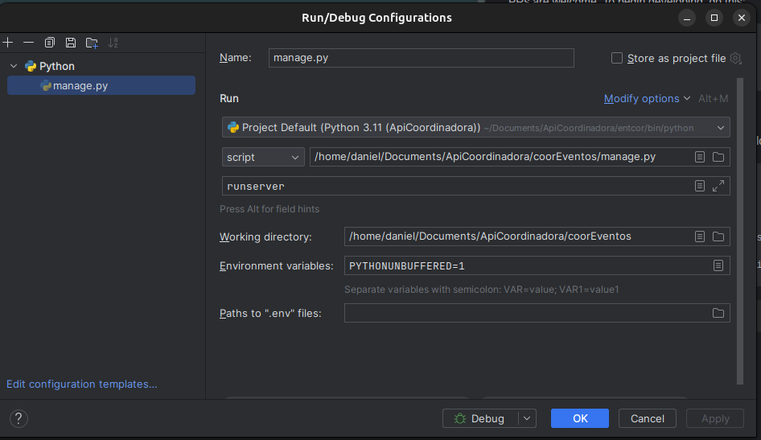
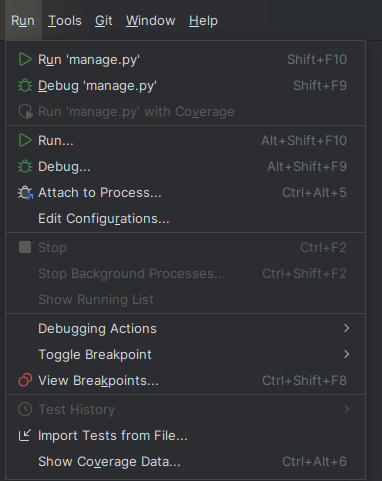
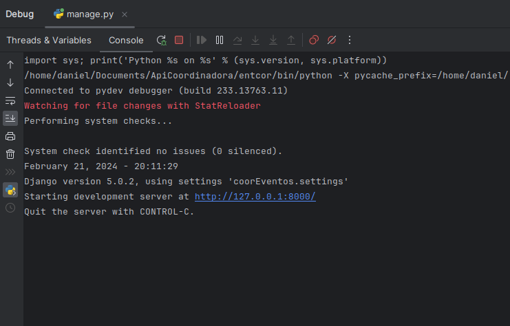
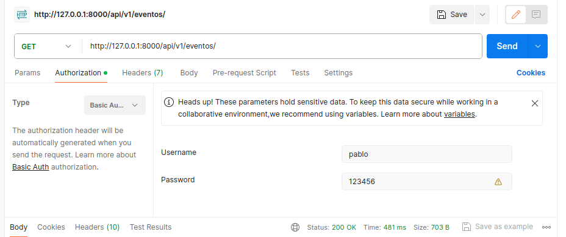
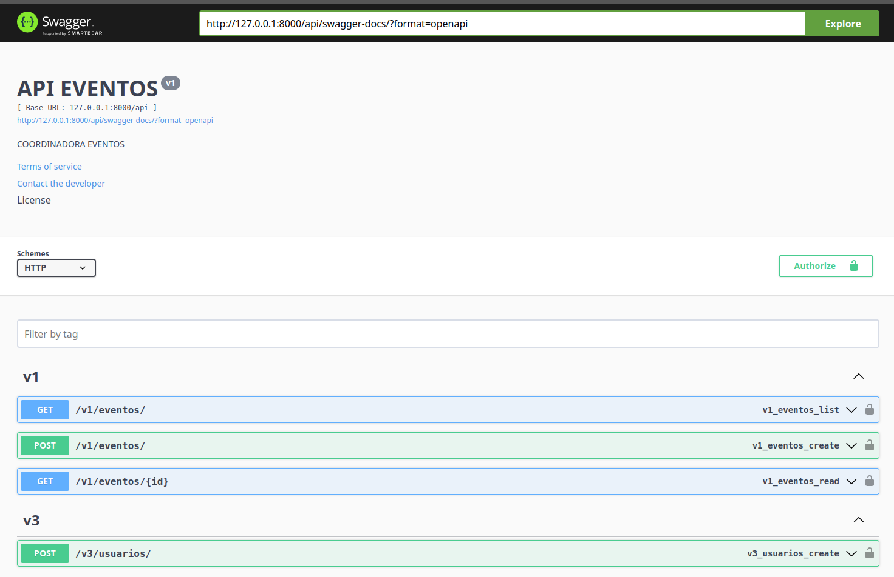

# Daniel

## Api Test 

- Descarga el codigo.
- Creación de la Base de Datos.
- Configuracion Pycharm Visual Studio Code
- Explicacion Api
- Swagger
- Video
- Features

## Installation

Descarga el codigo 

```bash
$ git clone https://github.com/Orionk999/ApiRestCoor.git
```

## Creación de la Base de Datos.

En una terminal realiza los siguientes comnandos.

```bash
$ sudo apt update
$ sudo apt install postgresql postgresql-contrib
$ sudo su - postgres
$ psql
$ create user YourUser with password '123456';
$ create database Eventos;
$ alter user YourUser with superuser;
$ grant all privileges on database Eventos to daniel;
$ psql -U YourUser -h 127.0.0.1 -p 5432 -d eventos
$ exit
$ \q
$ exit
```
Sal de la base de datos y ahora se realiza la instalación de pgadmin4

```bash
$ curl https://www.pgadmin.org/static/packages_pgadmin_org.pub | sudo apt-key add
$ curl https://www.pgadmin.org/static/packages_pgadmin_org.pub | sudo apt-key add sudo sh -c 'echo "deb https://ftp.postgresql.org/pub/pgadmin/pgadmin4/apt/$(lsb_release -cs) pgadmin4 main" > /etc/apt/sources.list.d/pgadmin4.list && apt update'
$ sudo apt install pgadmin4
```

Una vez descargado el codigo /ApiCoordinadora/coorEventos, en una terminal hacer los siguientes comandos.
Los dos primeros permiten la creacion de las tablas asociadas a la aplicacion api.

El comnado migrate realiza la creacion de tablas propias del res_framework de python para usuario Authorizaciones 
permisos tokens etc.


## Configuración código

Utilice Pycharm o Visual Studio Code y abra el path del código.

Una vez se ha ubicado en la carpeta que contiene el archivo Requirements deberá ejecutar lo siguiente

```bash
$ pip install -r Requirements
$ sudo apt install python3.10-env
$ python3 -m venv myent
```

Ahora ubicado en la misma carpeta donde se encuentra el archivo manage.py hacer

```bash
$ pip install -r Requirements
```

Es necesario crear un entorno que se realiza ubicado en la carpeta que contiene el codigo descargado.
En la siguiente linea se muestra el ambiente creado que es entcor.

```bash
$ python3 -m venv entcor
$ source entcor/bin/activate
```
Los siguientes comnados crearan las tablas en la base de datos referentes a los modelos.

```bash
$ python3 manage.py makemigrations api
$ python3 manage.py migrate  api
$ python manage.py migrate  
```
en la ubicacion del archivo requeriments.txt

```bash
$ sudo pip install -r requirements.txt
```
ahora en la ubicacion del archivo manage.py ejecuta 

```bash
$ sudo python3 manage.py runserver
```
y ahora podrias abrir los editores y ejecutar los siguientes comandos para trabajar mas comodo.

Pycharm --> File --> Open
Visual Studio Code --> File --> Open 
En Visual Studio Code ejecute el comando runserver

Pycharm --> Run --> Edit Configurations --> :


 

Posterior al paso anterior ejecute la api





Obtendra la siguiente salida en la consola: 





## Explicación Api

Existen 4 urls desarrolladas para esta api, las cuales son:


El siguiente es el Body para registrar un usuario maria con su email y un password.

POST
http://127.0.0.1:8000/api/v3/usuarios/

Request
```json
{
    "username": "pablo",
    "email": "pedro@gmail.com",
    "password": "123456"
}
```
Response
```json
{
    "username": "pablo",
    "email": "pedro@gmail.com"
}
```

Url para generar el Token con el que se podrá acceder a las siguientes rutas:

POST

http://127.0.0.1:8000/api/v4/login/

Request
```json
{
    "username": "pablo",
    "email": "pedro@gmail.com"
}
```

Response
```json
{
    "token": "7585ddde0d83a27a5ebcd72988b65cc2adc6d1d9"
}
```

Url para listar Eventos

GET

http://127.0.0.1:8000/api/v1/eventos/

Request

Body is Empty.

But you need fill Basic Atuhorization:



Response
```json
[
    {
        "id": 1,
        "nombre": "Reunion",
        "descripcion": "Medellin",
        "latitud": 4.60971,
        "longitud": -74.08175
    },
    {
        "id": 2,
        "nombre": "Cumpleaños",
        "descripcion": "Medellin",
        "latitud": 4.60971,
        "longitud": -74.08175
    },
    {
        "id": 3,
        "nombre": "Torneo",
        "descripcion": "Medellin",
        "latitud": 4.60971,
        "longitud": -74.08175
    },
    {
        "id": 4,
        "nombre": "Politico",
        "descripcion": "Medellin",
        "latitud": 4.60971,
        "longitud": -74.08175
    }
]
```

## Swagger

you can put the url in your browser:

http://127.0.0.1:8000/api/swagger-docs/




## Video

## https://www.youtube.com/watch?v=H2cDlR0DA5g

## Feautures

Se avanzara en la seccion del mapa solicitada.
 

## Credits

This software uses the following open source packages:

- First Image is taken from [here](https://github.com/karan)
- Developer [here](https://github.com/Orionk999)
 

## License

MIT

---

> [www.whynotstreet.com](https://www.whynotstreet.com) &nbsp;&middot;&nbsp;
> GitHub [@Orionk999](https://github.com/Orionk999) &nbsp;&middot;&nbsp;

> _Es genial trabajar con ordenadores. No discuten, lo recuerdan todo y no se beben tu cerveza.  Paul Leary_ 


